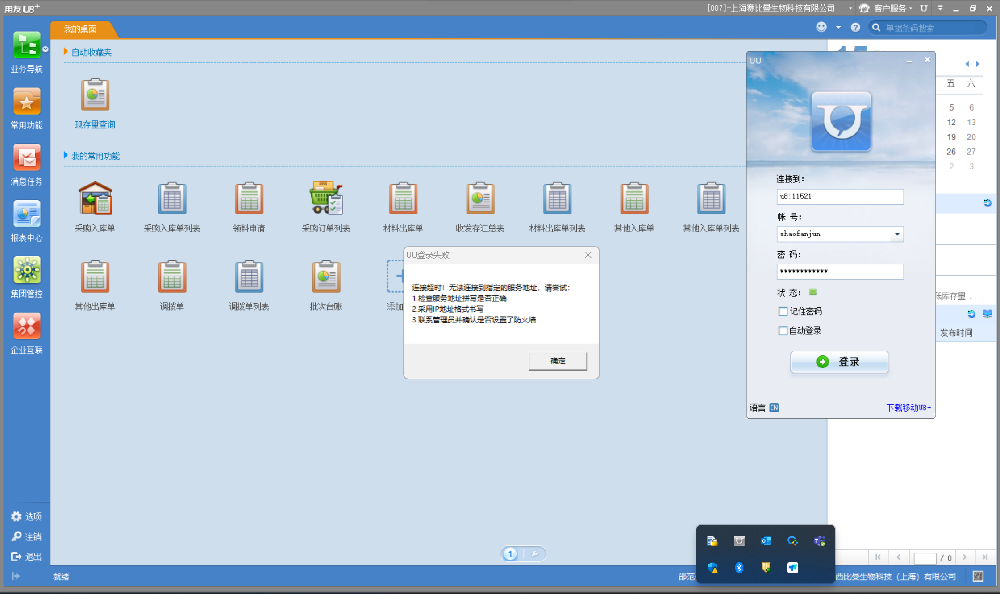
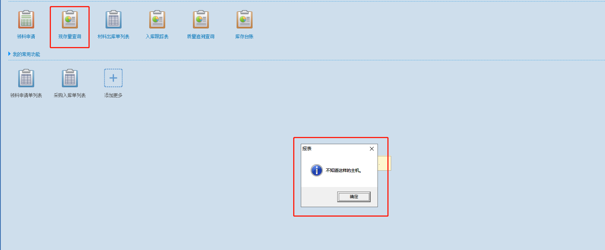
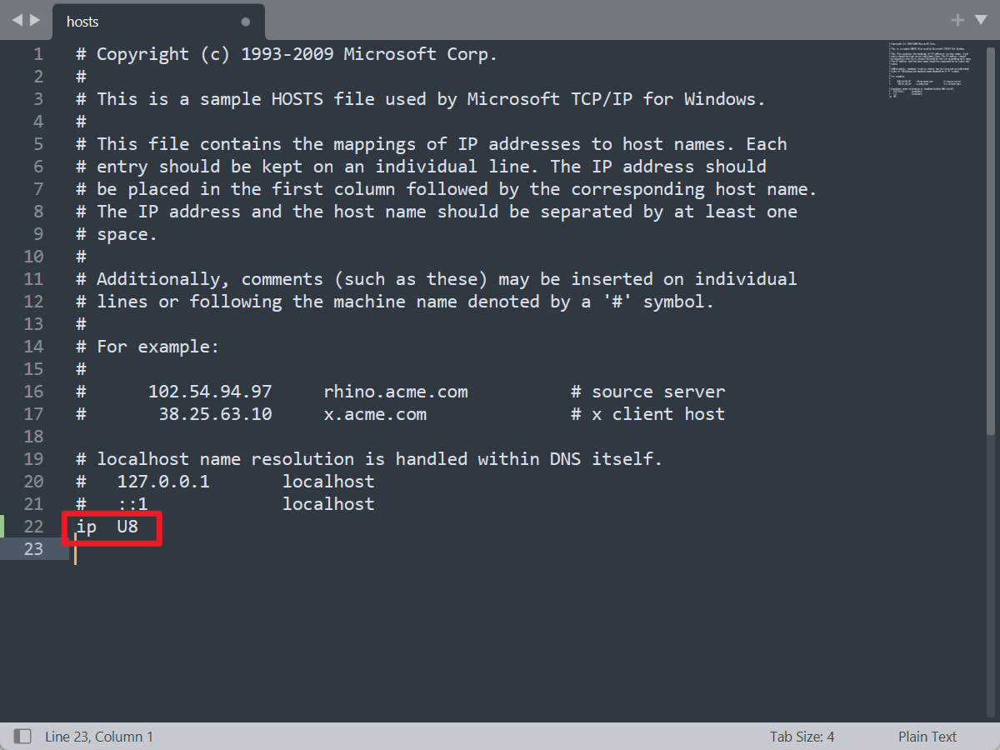

出现问题：

使用Profwiz工具进行迁域之后，部分用户上报用友U8报表查询功能报错，提示**不知道这样的主机**;**UU登录失败**，如图所示。





解决方案：

1、服务器的各种端口对此客户端开放，常用的有1433、11520、9832。然后看此客户端是否和服务器在同一网段。 

2、在客户端机器上修改hosts文件，把服务器的IP地址和计算机名加入，最后关闭客户端和服务器的防火墙。 这个问题是因为服务器名称不能正确解析到 服务器IP地址。这样就需要在

```
C:\ WINDOWS \system32\drivers\etc
```

文件夹下打开hosts文件里面把服务器名和IP地址绑定了，不会出现找到主机这样的问题了。

注意：

1、hosts文件配置 ，IP与计算机名中间为TAB空格。



2、如果在操作之前没有进行其他设置，直接修改hosts文件可能是解决问题的一种方法。确保在修改之前备份hosts文件，并添加服务器的IP地址和计算机名。如果问题仍然存在，可能需要考虑其他网络或服务器配置。建议在进行任何更改之前咨询网络管理员或系统支持，以确保正确性。
